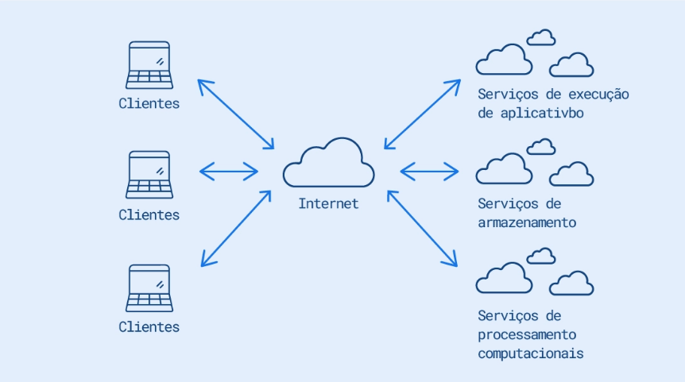
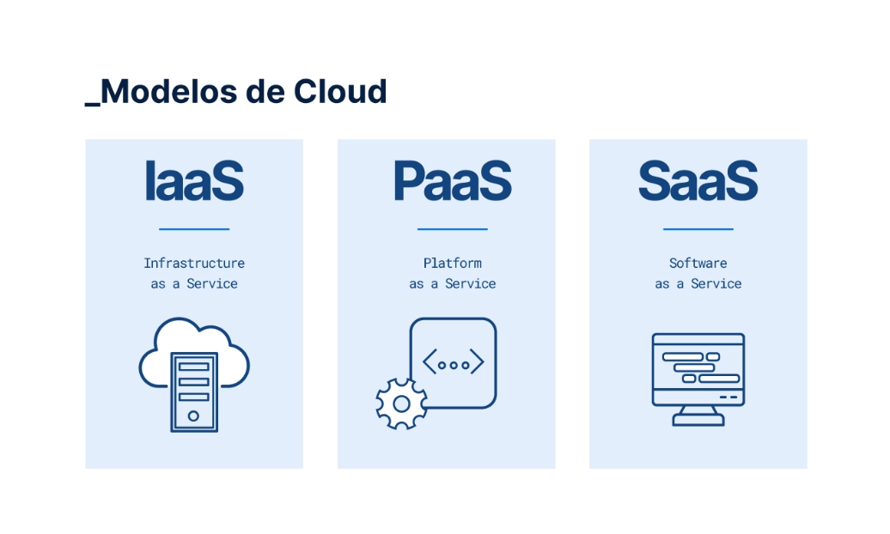
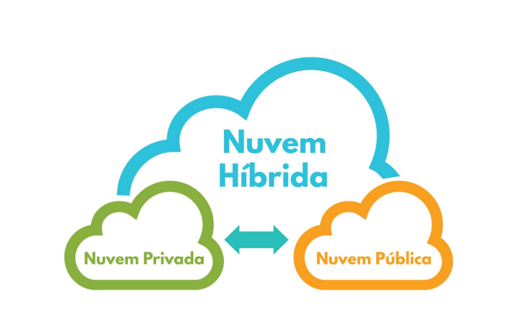
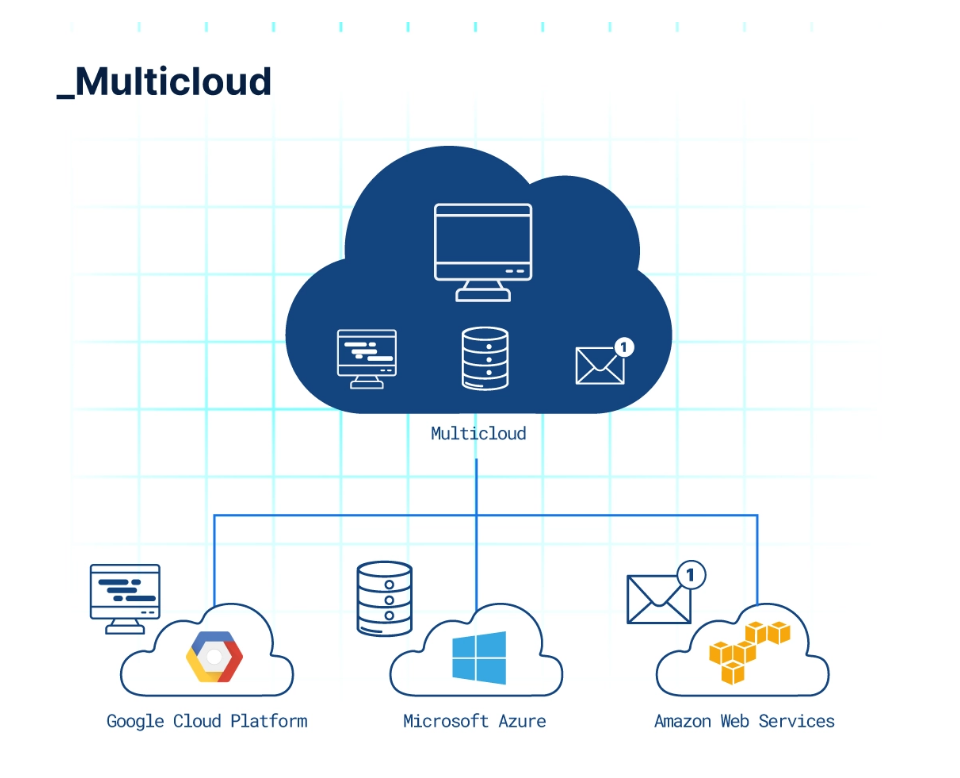
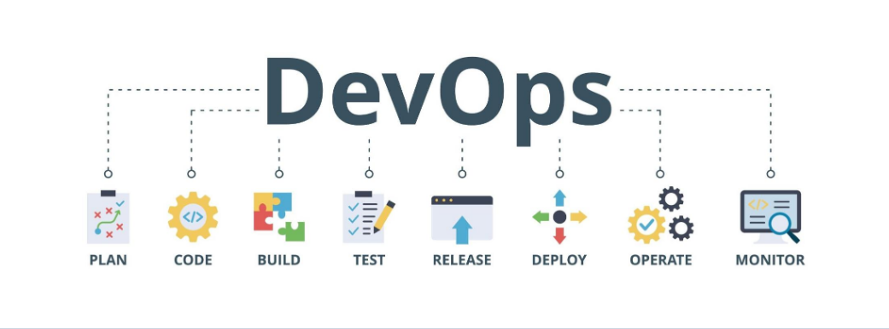
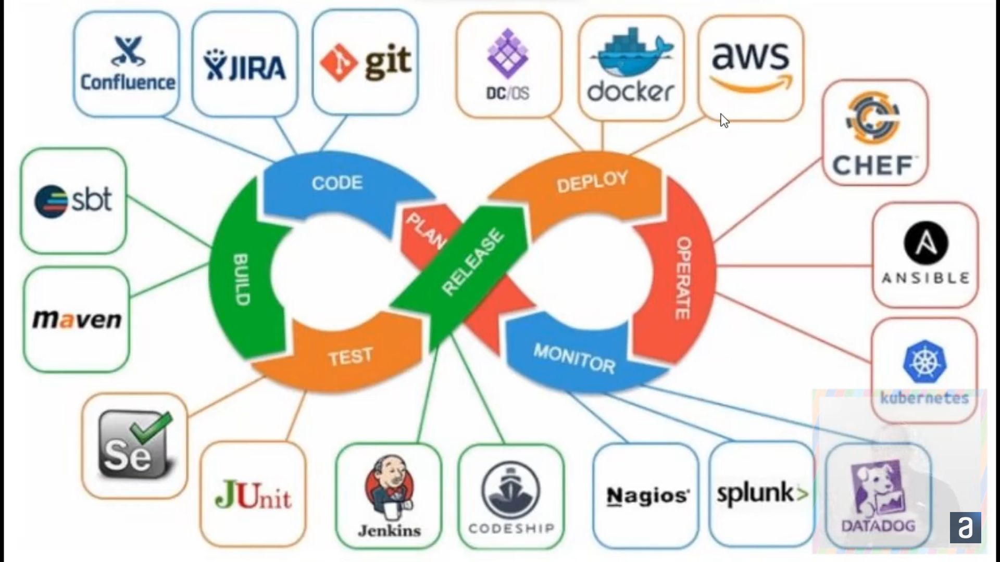

# Começando com cloud

## O que é a nuvem?
Uma nuvem pode ser entendida como um conjunto de aplicações, armazenamento e computação que tem como base a internet como plataforma de funcionamento. E esse pool de serviços possui capacidade suficiente para dar suporte à maioria das necessidades de grande parte dos usuários.

## Matera
empresa especializada em bancos e fintecs.
> curiosidade do PIX: disponível 24/7, confiabilidade de 99.9%, pagamentos tem que responder em até 1.9 segundo e recebimento em até 2.3 segundos.

O pix é baseado em microsserviços. Utiliza kubernets

**helm charts** é basicamente uma infraestrutura para códigos para coisas que estão dentro do kubernets, dentro do kubernets temos os pods e regras para conversar entre eles, no helm charts podemos automatizar a criação dessas construções em um script único que podem ser parametrizados, o helm charts é basicamente um template para configurações do kubernets. (minhas palavras: é como se fosse um dockercompose, dizendo beeeem forçadamente.)

No matera, vários tipos de testes e mocks foram criados, o que é normal em uma empresa grande.

## Desvantagens do CLOUD!!!
- Dependência da rede.
- Falhas na estrutura do data center ou em algum servidor podem impedir o trabalho ou uso do recurso oferecido pela nuvel.
- Falhas no acesso podem ocorrer por recursos compartilhados entre empresas (pode acontecer em alguns provedores)
- Perda ou sequestro dos dados podem ocorrer (difícil)

## Modelos de cloud

### **IaaS** - Infrastructure as a Service
Esse modelo disponibiliza um ambiente com uma infraestrutura virtualizada, possibilitando o uso de recursos de computação, armazenamento e rede.

Serviços que utilizam:

>Amazon Web Service

>Google Compute Engine

 

### **PaaS** - Plataform as a Service

No PaaS, é criado um ambiente para **programação** e o desenvolvimento de alguma solução, temos um programa ou serviço entregue com o objetivo de facilitar a implementação de algum serviço.

Exemplos de PaaS:
>Heroku

>Red Hat OpenShift

 

### **SaaS** - Software as a Service

O software é executado em um servidor, tirando a necessidade do cliente tê-lo instalado em sua máquina.

Exemplo de SaaS:
>Gupy

>Trello

Alguns desafios para esse tipo de modelo são a dificuldade da integração dos recursos internos da organização, disponibilidade e segurança da informação.

## Tipos de CLOUD

Atualmente, temos três tipos de cloud, assim como na imagem abaixo:

**Cloud Pública**: É o tipo que mais vemos sendo utilizados por empresas. Basicamente, a cloud pública compartilha, através de uma gama de servidores interconectados, recursos e serviços entre usuários.

**Cloud Privada**: Diferente da Cloud Pública, os recursos e serviços utilizados por uma empresa é de exclusividade da mesma, sendo assim, um data center é alocado somente para esse objetivo, podendo ser cuidado pela própria empresa.

**Cloud Hibrida**: A nuvem hibrida é a junção da nuvem privada com a nuvem pública, uma empresa pode manter sua aplicação rodando em uma nuvem pública e seus dados em uma nuvem privada, por exemplo.

> Um termo muito utilizado nesse ramo é o *On Promise*, trata-se de um ambiente onde fica as máquinas em um espaço físico da empresa, em contrapartida temos  um ambiente em nuvem.

## **Case BancoPAN**
O case aborda a introdução da Cloud no banco pan. Principal dificuldade era o monitoramento e a dificuldade para identificar erros na hora de subir mudanças, antes eram on-premise, ou seja, rodando local, agora está hibrido com a nuvem.

termos utilizados:
- **On-premise:** software local é instalado e executado em computadores nas instalações da pessoa ou organização que usa o software, em vez de em uma instalação remota, como um farm de servidores ou nuvem.
- **Monolíto:** Arquitetura Monolítica é um sistema único, não dividido, que roda em um único processo, uma aplicação de software em que diferentes componentes estão ligados a um único programa dentro de uma única plataforma.
- **Microsserviços:** Microsserviços são uma abordagem arquitetônica e organizacional do desenvolvimento de software na qual o software consiste em pequenos serviços independentes que se comunicam usando APIs bem definidas. Esses serviços pertencem a pequenas equipes autossuficientes.
- **arquitetura orientada a eventos ( EDA ):** É um padrão de design de software que permite a uma organização detectar "eventos" ou momentos de negócios importantes (como uma transação, visita ao local, abandono do carrinho de compras, etc.) e agir sobre eles em tempo real ou quase real.

## **Multicloud**
Em uma multicloud, encontramos a utilização de mais de um serviço de provedores de nuvem publica ou privada, por definição, "toda nuvem híbrida é uma multicloud, mas nem toda multicloud é uma nuvem híbrida".

 A escolha de uma abordagem multicloud, combinando a utilização de mais de um provedor de serviço de nuvem, pode favorecer estratégias que possibilitam:

- **Diminuir a indisponibilidade:** Replicando dados e serviços.

- **Redução de custos:** Distribuira a carga de trabalho entre as nuvens contratadas.

- **Melhor resposta a desastres:** Sistema pode não cair totalmente, podemndo conter cópias de segurança em cada cloud.

- **Flexibilização geográfica:** Podemos ter diferentes servidores localizados em diferentes países ou regiões.

- **Utilizando o melhor de cada um:** Cada Cloud tem um ponto forte que se destaca dos demais, podemos utilizar isso ao nosso favor.

# Principais plataformas de cloud

### **AWS ou Amazon Web Services**
É a plataforma de cloud da Amazon. Lançada em 2006, provê uma série de serviços para desenvolvedores e empresas hospedarem e manterem aplicações e infraestrutura.

### **Azure**
A Microsoft também possui sua plataforma de nuvem com a oferta de produtos e serviços em tecnologia, o Azure. Ele foi apresentado ao mundo em 2008 com o nome de Windows Azure, mas somente em 2010 teve o seu lançamento oficial para o mercado. Em 2014, passou a ser chamado de Microsoft Azure, como é conhecido até hoje.

### **Google Cloud**
Plataforma do Google que entrega uma suite (conjunto de ferramentas) para computação em nuvem, o que possibilita criar, implantar e gerenciar aplicativos na nuvem, além de oferecer infraestrutura para hospedagem de sites, máquinas virtuais, bancos de dados, entre outros.

## **Microsoft Azure - Hipsters Ponto Tech**

> Multicloud, Hybrid cloud and Edge Computing são palavras chaves.

- **Lift and Shift:** O modelo Lift and shift, também conhecido como rehosting, é uma abordagem para migrar aplicativos para a nuvem. Esta estratégia não envolve alterações na arquitetura do aplicativo e quase nenhuma (ou nenhuma) alteração no código do aplicativo, possibilitando consequentemente uma migração mais rápida e barata.

O tipo de cloud mais procurado por empresas são os **IaaS**, mais especificamente, as máquinas virtuais onde fazer o *lift and shift* das suas aplicações que rodam *on premise* são essenciais para a migração pra nuvem.

<iframe width="544" height="304" src="https://www.youtube.com/embed/_nCESq0ggRg" title="Dev em T: programação, carreira e tipos de perfil | #HipstersPontoTube" frameborder="0" allow="accelerometer; autoplay; clipboard-write; encrypted-media; gyroscope; picture-in-picture; web-share" allowfullscreen></iframe>

## **"Profissional em T"**
É um profissional que é tanto especialista quanto entusiasta em temas que estão ao seu redor, como um profisisonal de front-end que conhece um pouco de UX e UI, que por consequência acaba aprendendo um pouco de back-end ou um profissional de dados que, além de ser um especialista em estatística, conhece de plataformas de nuvem que somam bastante com seu *pool* de estratégias.

Os **4 e's:**  Exploração, expansão, expertise e experiência.

- **Exploração:** Ser uma pessoa curiosa, ser um "profissional em T".
- **Expansão:** Desenvolver a habilidade de ensinar o que você aprende, assim você tem o melhor feedback sobre o que você precisa melhorar na sua explicação.
- **Expertise:** Saber além do framework, se aprofundar um ou dois níveis abaixo, assim você se torna referência quando alguém estiver tendo problemas, esse é o próximo passo após você dominar uma biblioteca/framework.
- **Experiência:** Experiência fala sobre resiliência, disciplina, buscar ajuda em comunidades como discord, blogs para ganhar experiência, dê tempo ao tempo para se tornar um sênior, sempre vai ser uma bateção de cabeça até você consegui falar que domina algo.

 

## **Cloud Coding**
Aqui são alguns exemplos de PaaS (Plataforma as a service) que existem hoje no mercado:
- GitHub;
- Heroku;
- Replit;
- Cloud Code.

# **Boas práticas**
    

<iframe width="544" height="304" src="https://www.youtube.com/embed/GUanHEGlje4" title="Como desenvolver boas práticas de programação? com Fabio Akita | #HipstersPontoTube" frameborder="0" allow="accelerometer; autoplay; clipboard-write; encrypted-media; gyroscope; picture-in-picture; web-share" allowfullscreen></iframe>

As boas práticas mudam de acordo com o tempo, com a capacidade de processamento e com a comunicação da epoca. Antigamente eram utilizados terminais remotos, vários computadores com memórias minusculas fazendo um esforço enorme para rodar algum programa, hoje, temos um macbook com capacidade para rodar 10 dockers com microsserviços ao mesmo tempo, ou seja, os tempos mudaram, a capacidade de processamento mudou, logo, o *design pattern* muda.

> Um insight legal dito no vídeo e que eu tomei como verdade devido minhas experiências é a preocupação com o *design pattern* logo nas primeiras experiências na programação. as vezes, nós não lançamos o site da padaria do vizinho por medo de não atender um padrão de mercado em relação a segurança, escrita de código, tratamento de erros, testes e todas as possibilidades possíveis daquilo dar errado, mas no final das contas, era só o site da padaria do vizinho que nossa cabeça transformou em um monstro.

A ideia das boas práticas é sempre pensar na manutenção e na legibilidade do código, imagine que um outro programador pegue seu código pra fazer alguma modificação no futuro, e esse futuro pode ser daqui a dias, semanas, meses ou anos, ele está legível o suficiente pra não atrasar o trabalho do parceiro? será que alguma modificação no seu código pode quebrar outro código com paralelo? Para o computador, tanto faz se você usou clean code, se seu código está sujo, se você está usando algum padrão ou não, mas para o humano, é essencial que o código esteja limpo e bem organizado.

## **Devops**
É um conjunto de processos, técnicas ágeis e ferramentas que ajudam a **entregar uma solução da sua concepção até a implantação em produção**, gerando valor para o nosso usuário, e em um contexto de **colaboração** entre equipes de desenvolvimento e operações.

Antes, tinhamos dois grupos: 
- **desenvolvimento:** Aqueles que visam inovação, se preocupam mais com a programação e com a funcionalidade dos códigos. 
- **operações:** Aqueles que se preocupam com riscos e com as operações das aplicações, garantindo estabilidade e desempenho.

O devops é o primeiro passo para derrubar essa divisão e juntas os dois grupos, fazendo com que novas funcionalidades cheguem à produção de maneira responsável, sem que o time de desenvolvimento espere 3 meses para um novo campo no banco de dadaos, diminuindo ou eliminando essa burocracia, melhorando a colaboração entre as equipes, isso é a cultura de devops.

O devops garante a entrega continua ou deploy continuo, fazendo com que o que entra hoje no desenvolvimento, saia amanhã no deploy, com segurança e evitando problemas, mas isso exige mais do que colaboração.

## **Como?**

Primeiro ponto, dependendo menos do servidor e mais de infraestruturas como containers, disponibilizando em um repositório de código todas as configurações, variáveis de ambiente, códigos e tudo que é necessário para que outra pessoa consiga reproduzir aquilo. Outro ponto é um pipeline continuo de deploy com jenkins e outras ferramentas que possibilite um deploy mais rápido e seguro. No ponto de segurança, temos diversas ferramentas de monitoramento para observar o sistema em produção, com alertas referentes a cada log.

# **Infraestrutura como código**
## **Terraform**
Imagine que você precise colocar sua aplicação para rodar em alguma cloud, você pode criar e configurar isso manualmente e subir, tudo na mão, mas e nas futuras atualizações? e se você precisar subir uma máquina 20 vezes? a opção de fazer tudo na mão já não fica viável, é ai que entra a infraestrutura como código onde uma das mais famosas é o **terraform**, nesse arquivo é possível configurar todo o seu ambiente virtual através de blocos de códigos padronizados, nele você já especifica como você quer que sua máquina seja criada a nível de hardware, assim, com um comando simples você já consegue subir toda a sua infraestrutura na nuvem.

<iframe width="544" height="304" src="https://www.youtube.com/embed/yKnkK4HxW8E" title="Terraform e máquinas virtuais no Google Cloud | #AluraMais" frameborder="0" allow="accelerometer; autoplay; clipboard-write; encrypted-media; gyroscope; picture-in-picture; web-share" allowfullscreen></iframe>

 

# **Como aprender melhor**

<iframe width="544" height="304" src="https://www.youtube.com/embed/uOagLB3uyeU" title="Como aprender melhor? Com Diogo Pires | #HipstersPontoTube" frameborder="0" allow="accelerometer; autoplay; clipboard-write; encrypted-media; gyroscope; picture-in-picture; web-share" allowfullscreen></iframe>

 

# **Como fazer um bom portifólio**

<iframe width="544" height="304" src="https://www.youtube.com/embed/gu1OXrirC0U" title="Como fazer um bom portfólio em tecnologia com Diogo Pires | #HipstersPontoTube" frameborder="0" allow="accelerometer; autoplay; clipboard-write; encrypted-media; gyroscope; picture-in-picture; web-share" allowfullscreen></iframe>

 

# **Conclusão**

Hoje, é indispensável o serviço em nuvem para uma empresa, mesmo que o seu legado esteja em on-promise, o próximo passo para o avanço é fazer o lift and shift para alguma provedora de nuvem. O serviço mais procurado é o IaaS, mas hoje, os serviços de IA tem ganhado bastante notoriedade pelo poder das redes treinadas disponibilizadas pela nuvem, poupando tempo e dinheiro.