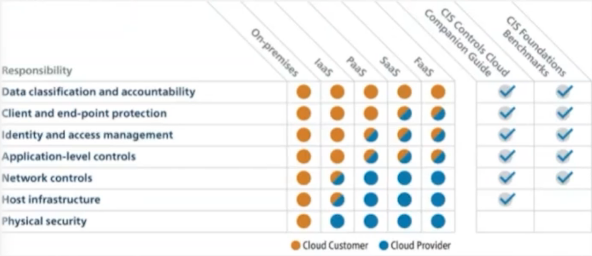
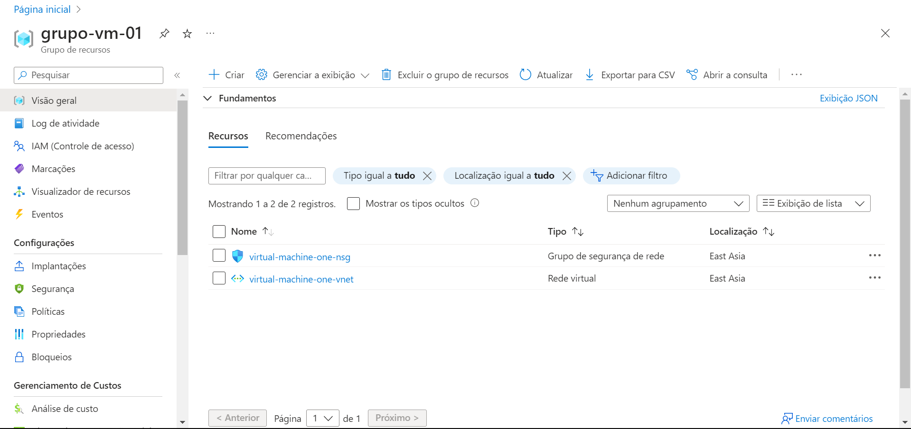
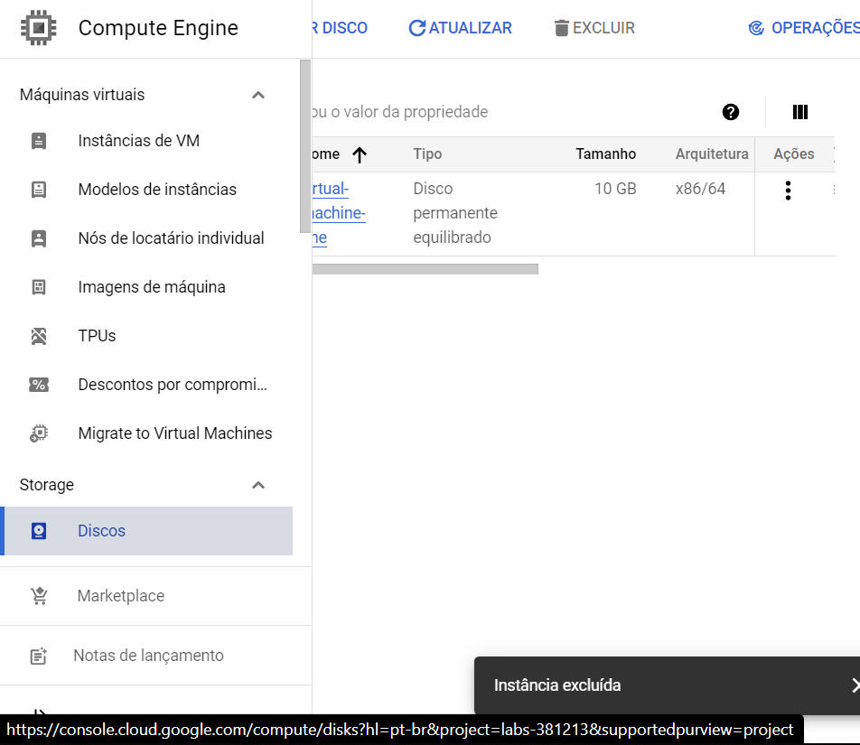
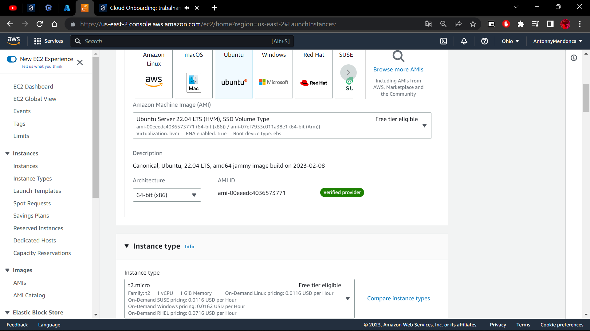
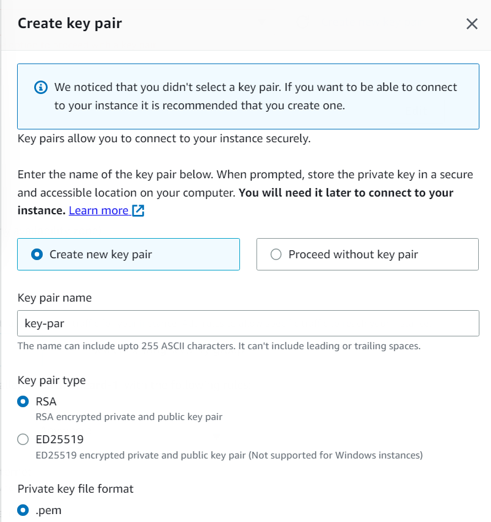
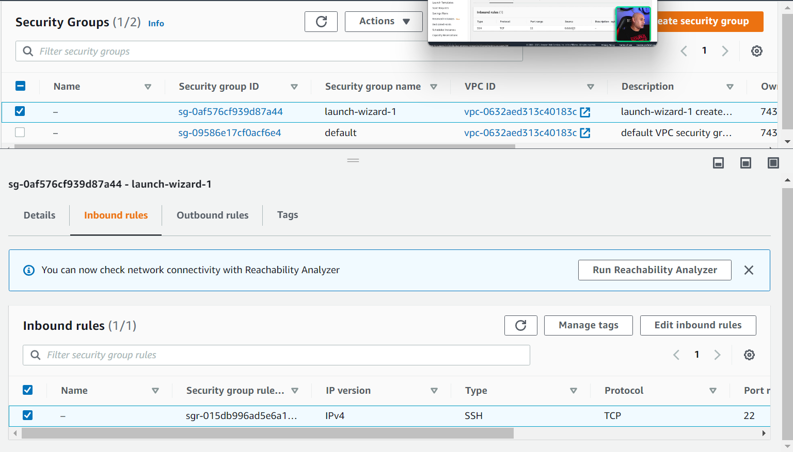
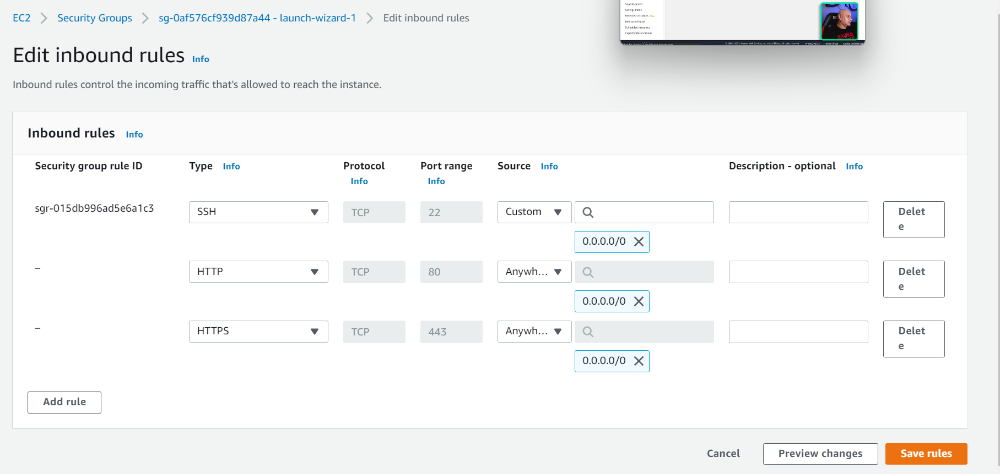
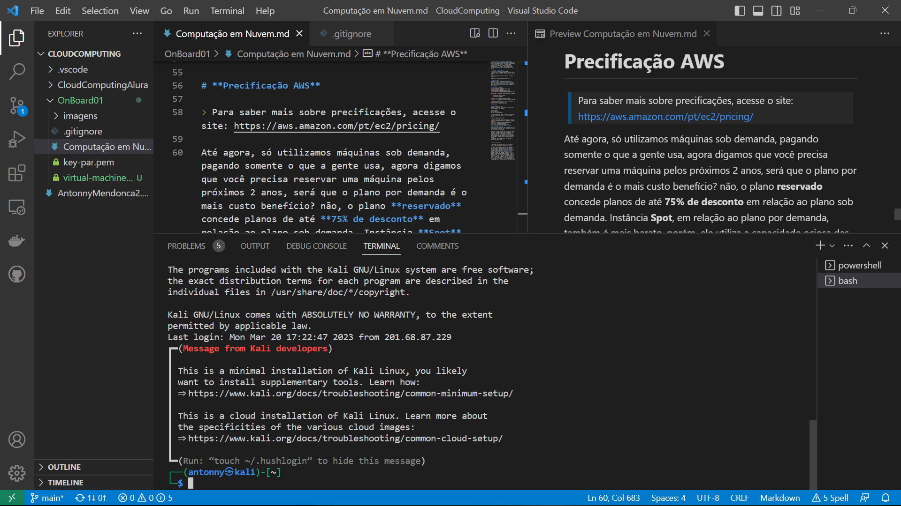

# **Modelo de responsabilidade compartilhada**

Parte da responsabilidade é por parte do provedor e a outra parte é do usuário, o provedor deve garantir, por exemplo, a segurança física dos equipamentos, já a maneira como os dados serão tratados e acessados são de responsabilidade do usuário.

# **Subindo VM na Azure**

É importante criar um grupo para a VM, assim você economiza tempo, deletando todos os recursos de uma só vez.

Basta ir na página inicial e "Excluir o grupo de recursos"



# **Google Cloud**
Diferente da Azure, o Google Cloud funciona a partir de Projetos e não grupos, sempre que vamos subir uma VM, precisamos ativar a API do Compute Engine API, uma vez ativada, a gente consegue criar uma instancia.

**Máquina gratis Google:**
.png)
.png)


Verificando se tudo esta certo com nginex, comandos:
```
    sudo apt-get install nginx
    curl http://127.0.0.1
```


É importante apagar o recurso inteiro, incluindo seus dependentes como discos etc.


# **AWS EC2**


User data é um campo para iniciar a máquina com alguns comandos, por exemplo:
```
#!/st/bin/bash
apt-get update -y
apt-get install apache2 -y
```
Precisamos também de um par de chaves para conectar via ssh, esse par de chaves é único para cada região.



O security group são regras para acessar a máquina virtual, precisamos habilitar o HTTP para conseguir conectar:



> **É bom trocar o SSH para aceitar conexões somente da nossa máquina**
Ao terminar uma instancia, ela é excluída, porém, o security group continua, não há nenhum custo, mas é bom remover pela organização.

Depois de um tempo considerável tentando, consegui acessar a máquina via SSH, não sei o que eu fiz de diferente, as regras de segurança permitiam conexões via HTTP, HTTPS e SSH de qualquer ipv4, mudei para "my ip" e funcionou, mas acredito que isso não tenha relação, dado que o erro continuou, mas eu pedi um "fingerprint" do erro e entrou de repente.

```
Falta de atenção minha, era só aceitar o aviso que na verdade era algo do tipo "continuar a conexão?" 
```

> No ubunto, ao invés do nginx, foi utilizar o apache2 para abrir HTTP.


# **Precificação AWS**

> Para saber mais sobre precificações, acesse o site: https://aws.amazon.com/pt/ec2/pricing/

Até agora, só utilizamos máquinas sob demanda, pagando somente o que a gente usa, agora digamos que você precisa reservar uma máquina pelos próximos 2 anos, será que o plano por demanda é o mais custo benefício? não, o plano **reservado** concede planos de até **75% de desconto** em relação ao plano sob demanda. Instância **Spot**, em relação ao plano por demanda, também é mais barato, porém, ele utiliza a capacidade ociosa das máquinas, ou seja, a AWS pode a qualquer momento parar a nossa instância para reservar para outro caso, mas em compensação, o custo pode chegar até 90% mais barato, esse case é utilizado quando não há problema em ter interrupções nas suas instâncias.


# **Bônus**
Consegui uma máquina Kali na Azure:
