# **Azure Blob**
É praticamente o S3 da Azure, para começarmos, basta ir na aba "Contas de Armazenamento" e criar uma conta, após isso, você consegue deve criar um container.
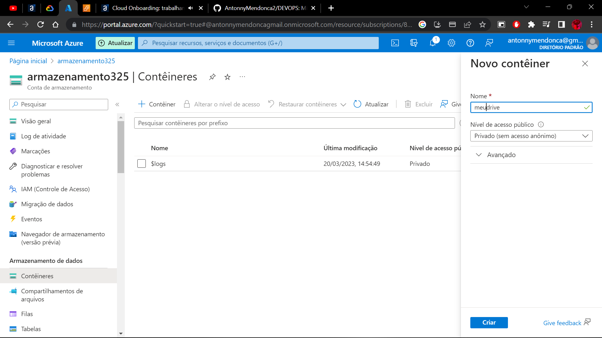

### Container configurado para acesso anonimo:
.png)
.png)

# Google Cloud
No **Google Cloud**, ao invés de um blob, nós criamos um bucket, basta **selecionar o seu projeto** e ir em **Cloud Storage**. 
É bem intuitivo, na maioria das vezes é next-next, com exceção dessa opção abaixo:
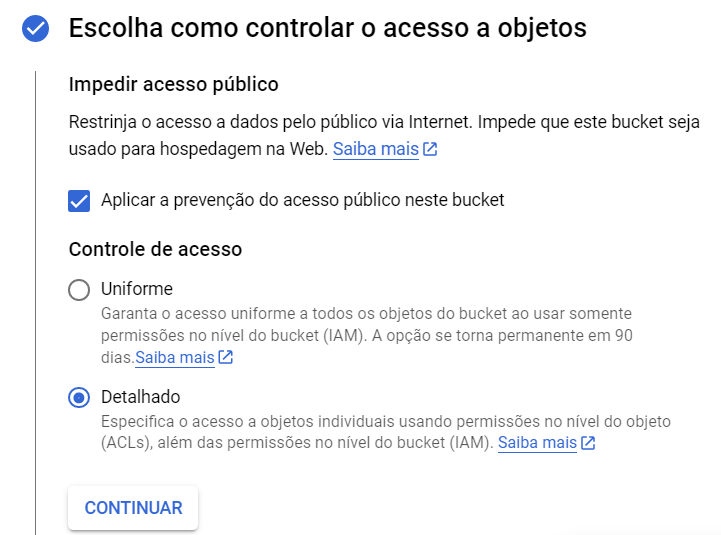
isso faz com que os dados não fiquem públicos.

No Google, é um pouco diferente da AWS, os arquivos ficam privados por padrão, precisando de autenticação para obter o acesso, podemos deixar público adicionando uma nova regra nessa tela:
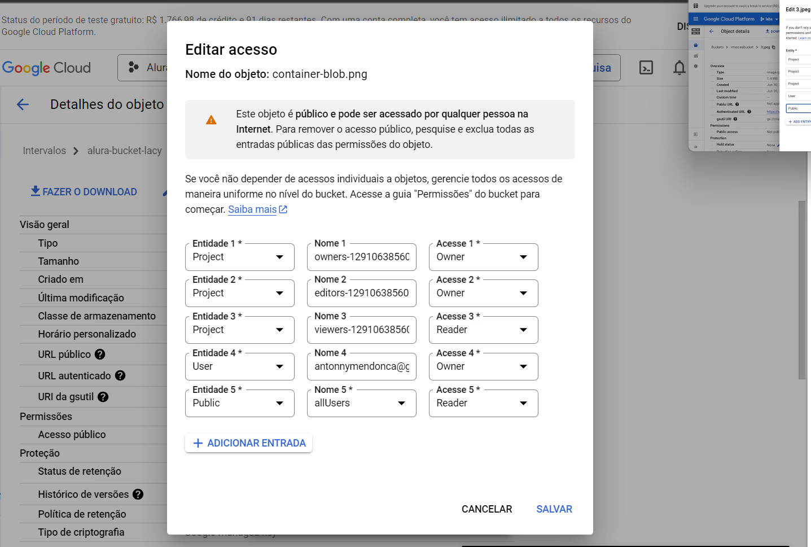
.png)

# AWS
O mais falado, **Amazon S3**.
É bem intuitivo, basicamente next-next, a diferença é que, na criação do bucket, é possível visualizar a opção de dados públicos:
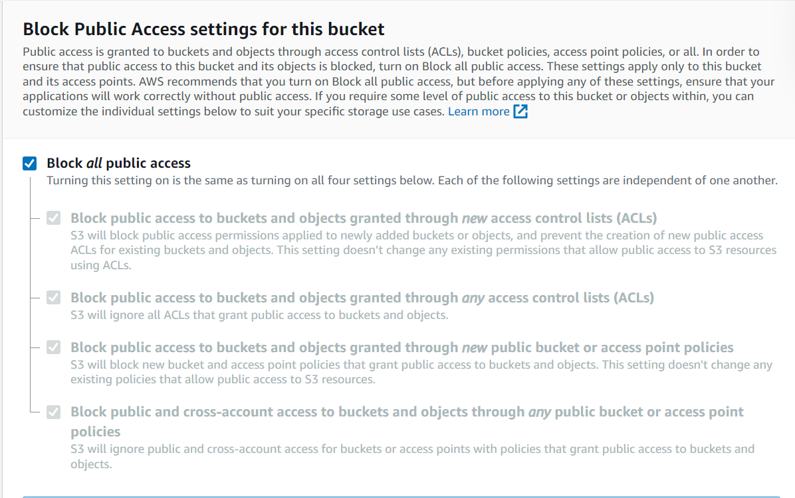
É possível desativa-la nas permissões do bucket.
Além de deixar o bucket público, é necessário mudar a permissão do arquivo individualmente, também na tela de permissões:


# **File Share**
## Azure
O file share serve basicamente como um Drive, nele você consegue subir arquivos e disponibilizar para qeu as pessoas comm as credenciais acessem. A vantagem é que você consegue criar como se fosse uma nova unidade de disco no seu computador.

A criação é muito simples, despensa uma explicação mais longa: **Conta de armazenamento** > **fileshare**.

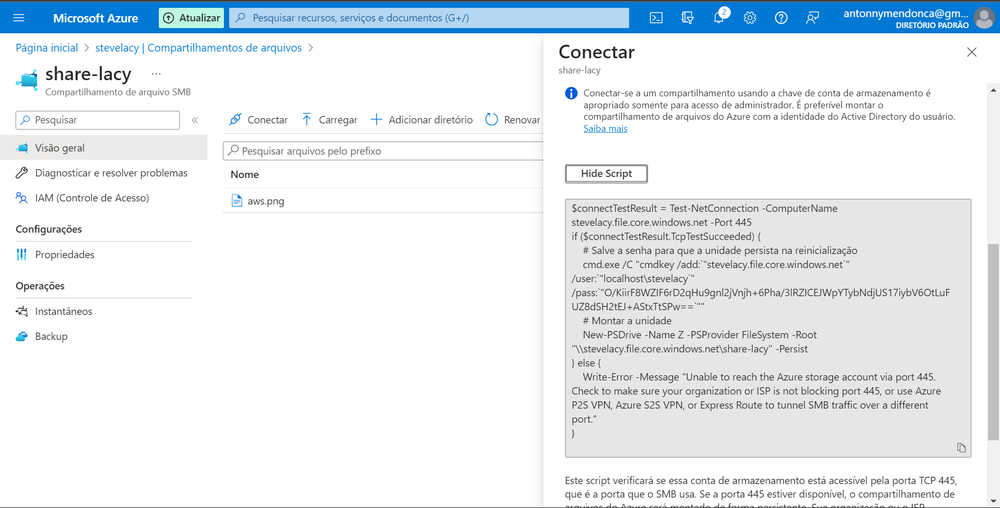

A fins de explicação, subi uma nova máquina virtual windows e testei o script de funcionamento que deve ser colado o powershell.

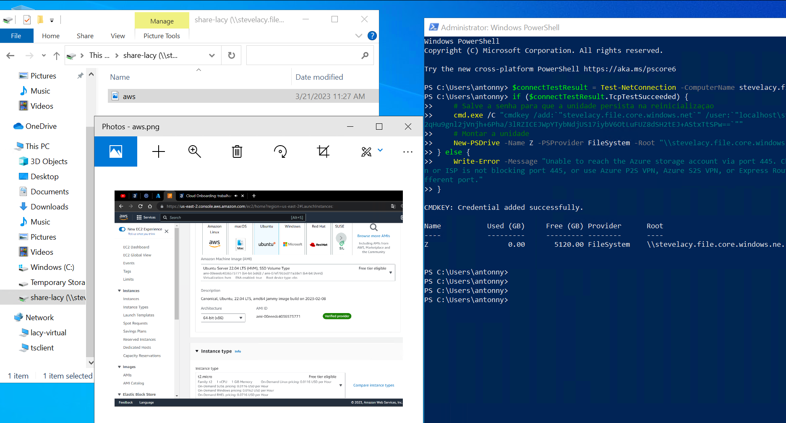

## Google Cloud
Na Cloud do Google é praticamente a mesma coisa, muito intuitivo, não testei, mas é ali que encontramos.
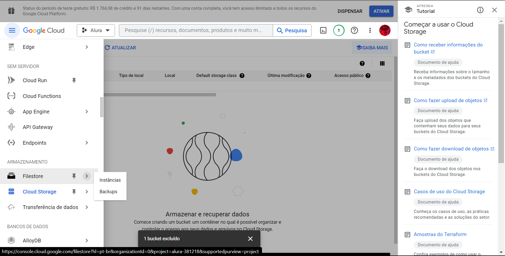

<div style="background-color: rgb(255, 0, 0); border-radius: 10px">

```
O preço desse serviço pode exceder o limita do free tier!!
```
</div>

## AWS

Utilizando o protocolo **NFS** para comunicar com o fileshare da AWS. O nome do serviço é **EFS (Elastic File System)**

O que ele faz aqui é como se fosse a criação de um disco em uma instancia e a gente é cobrado pela utilização, diferente do google que já cobra um tamanho fixo.
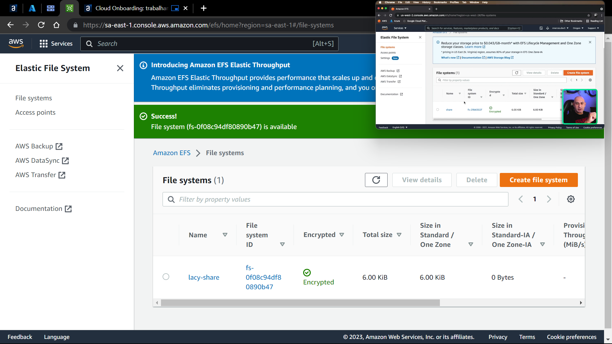

Para acessar o EFS, é necessário baixar na nossa instancia o pacote chamado amazon-efs-utils, basta rodar o comando abaixo:

```CMD
  amazon: sudo yum install -y amazon-efs-utils
  ubuntu: sudo apt-get -y install nfs-common
```

Para encontrar o atalho de conexão, basta em attach dentro do EFS:
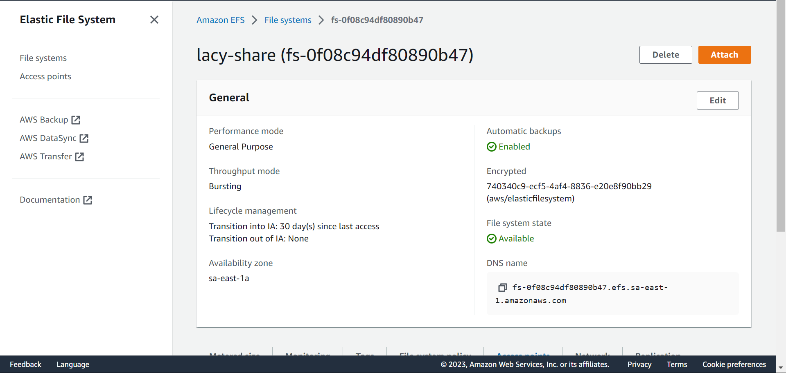

de inicio, vamos "Montar via ip"

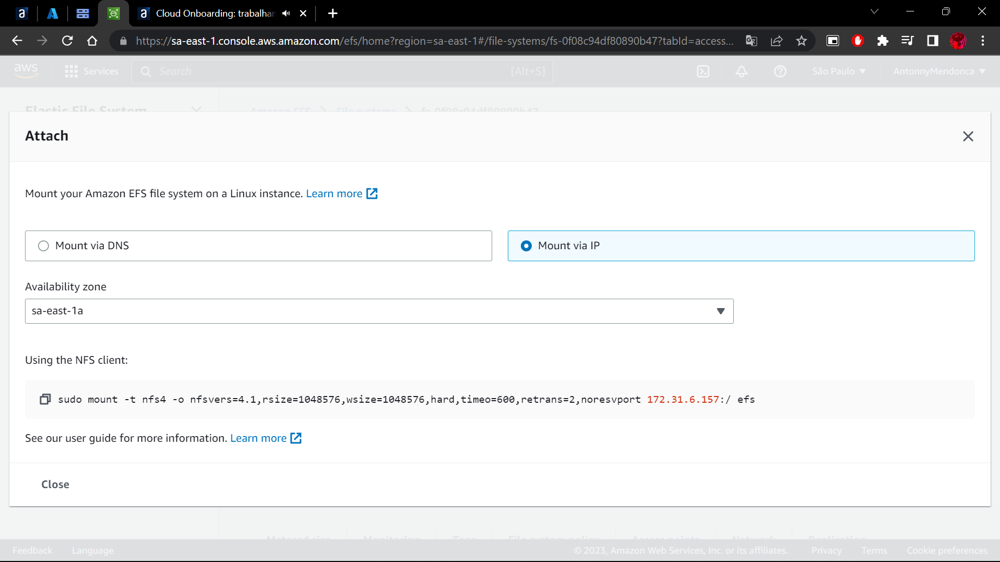

> No final do código, temos que colocar um diretório no qual nosso EFS será montado, é importante dar um mkdir com o nome do diretório

```CMD
sudo mount -t nfs4 -o nfsvers=4.1,rsize=1048576,wsize=1048576,hard,timeo=600,retrans=2,noresvport 172.31.6.157:/ DIRETÓRIO
```
<div style="background-color: rgb(255, 0, 0); border-radius: 10px; text-align: center">

```
ATENÇÃO!!
```
</div>

A conexão não está completa por padrão, se o código acima for rodado, provavelmente a máquina tomara timeout, isso ocorre porque a nossa máquina **NÃO** está no mesmo security group que o **EFS**, onde vemos isso?

Nas configurações de rede do nosso **EFS**, podemos ver que o **Elastic File System** está rodando no security group *default*:

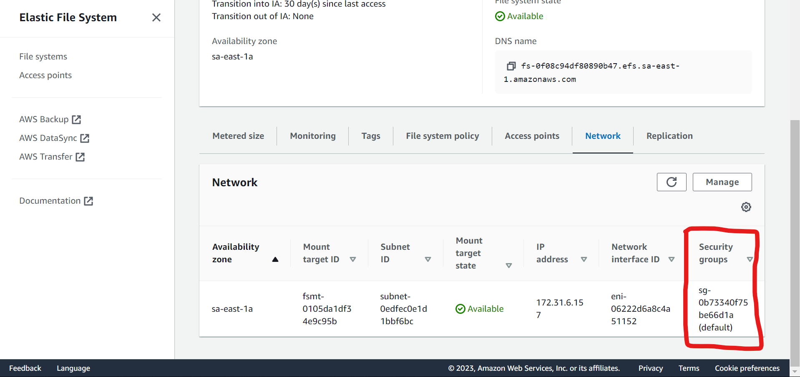

Enquanto a nossa máquina do **EC2** só está no security group Wizard, ou seja, as duas instâncias não estão se comunicando:

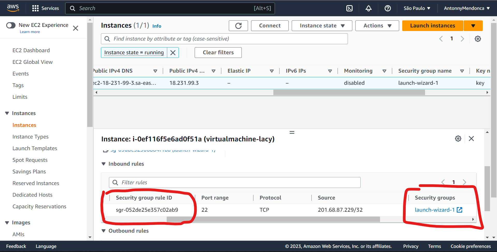

Para resolver isso, basta colocar a instancia EC2 no security group default, ou, de alguma forma, criar um security group comum para as duas instancias:

.png)

.png)

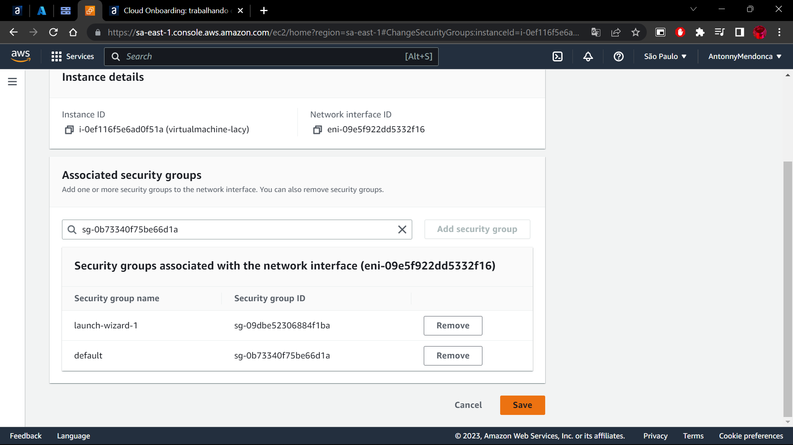

**Tudo Funcionando!**

Basta rodar o comando novamente que a conexão é estabelecida.

Para realizar um teste, basta criar um arquivo e tentar mover para a nossa pasta

```CMD
[ec2-user@ip-172-31-9-63 ~]$ mount | grep share
172.31.6.157:/ on /home/ec2-user/share type nfs4 (rw,relatime,vers=4.1,rsize=1048576,wsize=1048576,namlen=255,hard,noresvport,proto=tcp,timeo=600,retrans=2,sec=sys,clientaddr=172.31.9.63,local_lock=none,addr=172.31.6.157)
```

```CMD
[ec2-user@ip-172-31-9-63 ~]$ touch teste_EFS.txt
[ec2-user@ip-172-31-9-63 ~]$ ls
share  teste_EFS.txt
[ec2-user@ip-172-31-9-63 ~]$ sudo cp teste_EFS.txt share
[ec2-user@ip-172-31-9-63 ~]$ ls share
teste_EFS.txt
```

## **Vantagens do EFS(Elastic File System)**
Ele é um file system que fica na rede ao invés de um servidor, então ele é totalmente elástico, ou seja, você não precisa se preocupar em quanto de memória você ainda tem restante, pois ele consegue se adequar a quantidade que você precisa, ficando maior quando você precisa, a performance dele não cai de acordo com a quantidade de arquivo que você tem, muito pelo contrário, ela melhora, a performance IO é muito mais rápida pela forma que ele trata os dados.

O **EFS** está disponível em várias regiões, isso é extremamente redundante, sendo bastante utilizado por sistemas de clusters, o protocolo **NFSv4** ajuda bastante nessa questão de clusters pois em um ambiente real, é normal que as máquinas acessem umas as outras, trocando arquivos de forma direta a partir de um **cluster mestre**, o problema é que, se uma dessas máquinas cair, causa indisponibilidade, ou pior ainda, se um desses servidores for comprometido, não há uma redundância de seus arquivos, já no EFS, todos os clusters acessam o mesmo Elastic File System, ou seja, se um cluster cair, não há problema

# Criação de um novo disco na Google Cloud
Criação de um disco novo é a coisa mais simples do mundo, por padrão, ao criar uma instância, a plataforma já cria um disco pra gente, para criar um novo basta ir em **discos**>**criar** e ver qual é a opção que te atende melhor.

**Como ligar o disco à instância?**
Por padrão, ele não vem conectado à nenhuma máquina, como na imagem abaixo:


Para anexar, basta editar a instância e linkar, muito tranquilo.
> Lembrando! Para o disco aparecer na lista da VM, o mesmo tem que estar na mesma região da instância.


Ainda não acabou, o disco foi inserido fisicamente na máquina, mas ainda temos que criar a partição dentro da instância:

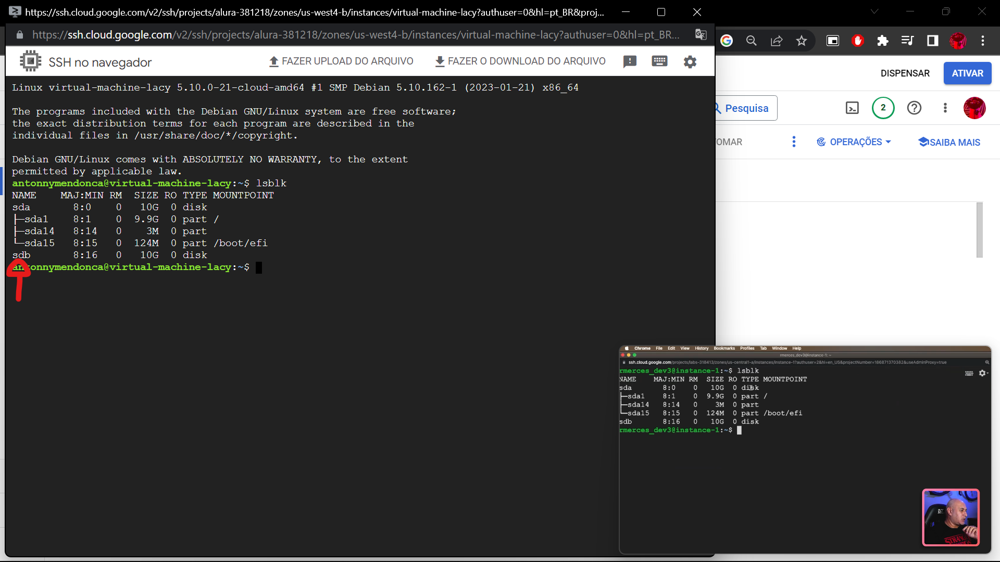

Seguindo os comandos abaixo, é possível criar essa partição:
```CMD
    sudo apt-get install fdisk
    sudo fldisk /dev/sdb
```
só confirmar todos os defaults (se não quiser criar outras partições) e pronto.

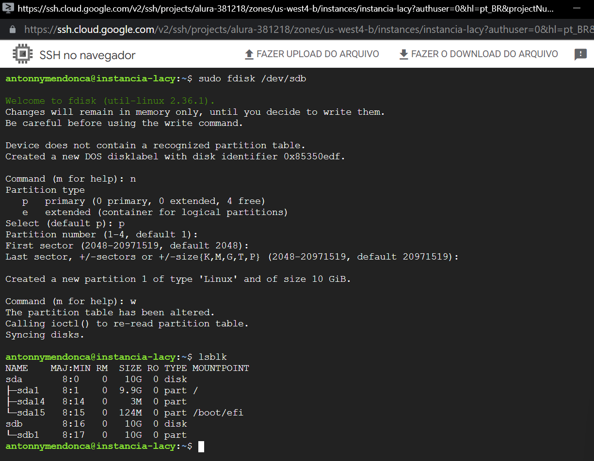

Instalando o file system
```CMD
    sudo mkfs.ext4 /dev/sdb1
```

Prosseguindo com a montagem do disco, devemos pegar o ID do nosso disco:

```CMD
antonnymendonca@instancia-lacy:~$ sudo blkid /dev/sdb1
```

O retorno vai ser esse abaixo, o que precisamos é somente do UUID:
```CMD
/dev/sdb1: UUID="6baff9c5-9b97-4ad0-9928-d26595b8be8b" BLOCK_SIZE="4096" TYPE="ext4" PARTUUID="85350edf-01"
```

Após isso, teremos que modificar um arquivo muito importante no file system

<div style="background-color: rgb(255, 0, 0); border-radius: 10px; text-align: center">

```
ATENÇÃO!!
Qualquer erro de digitação nesse arquivo pode ocasionar uma quebra no sistema e ele não ligar mais.
```
</div>

```CMD
antonnymendonca@instancia-lacy:~$ sudo vi /etc/fstab
```

deveremos inserir uma nova linha com o ID do nosso disco, seguido pela ponto de montagem:

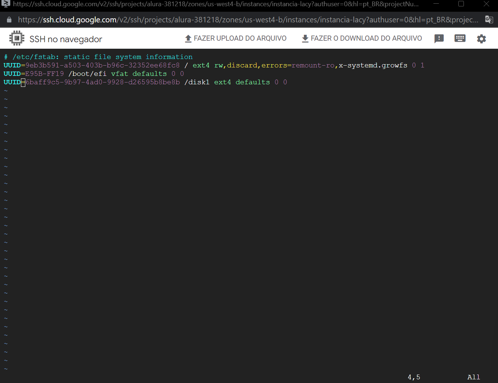

nesse caso, ainda não existia o caminho /disk1, bastou criar utilizando o mkdir

Em seguida, basta dar o comando:
```CMD
    sudo mount -a
```
para que o sistema monte o(s) discos especificado(s)

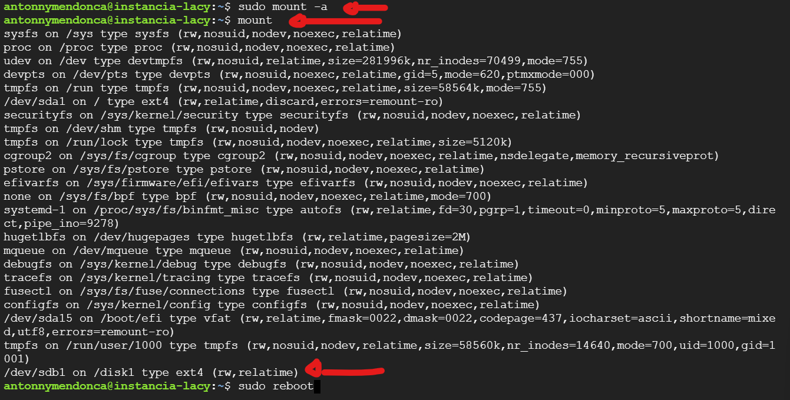

Após isso, basta reiniciar a máquina, se tudo ocorrer bem, será possível ver a partição, entrar nela e criar arquivos, assim como na imagem abaixo:

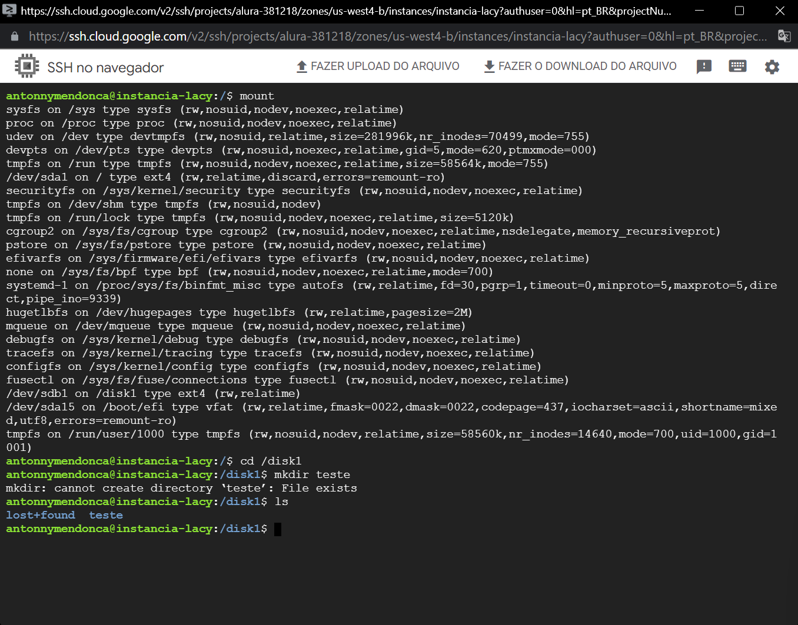
