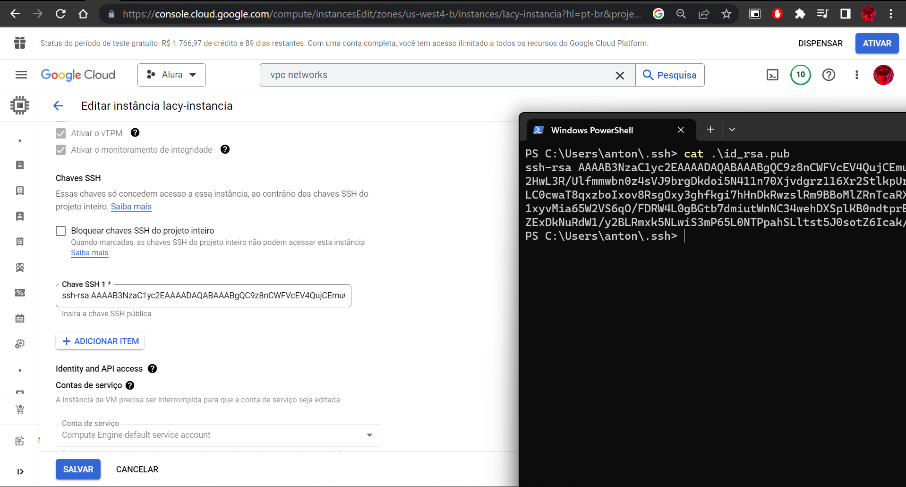
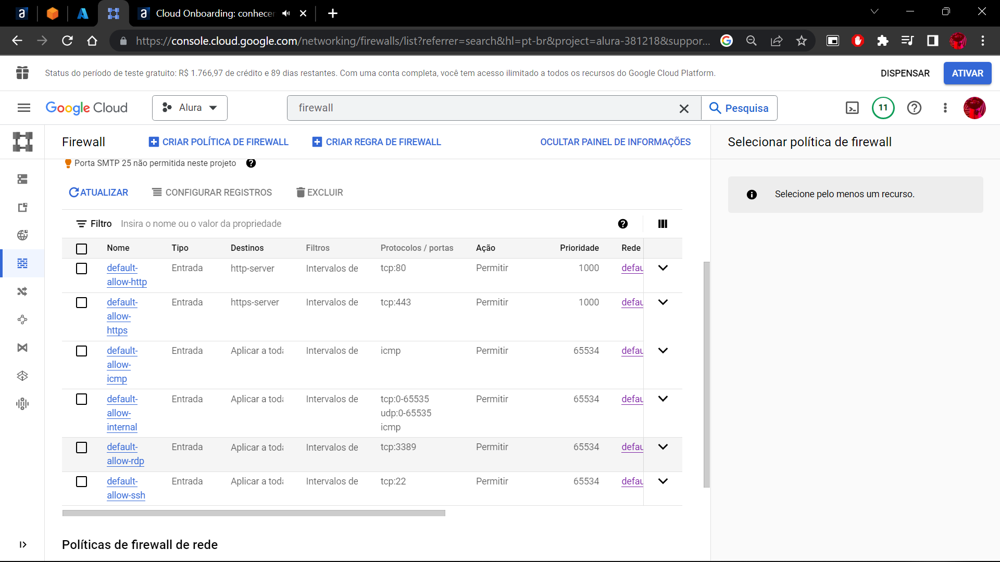
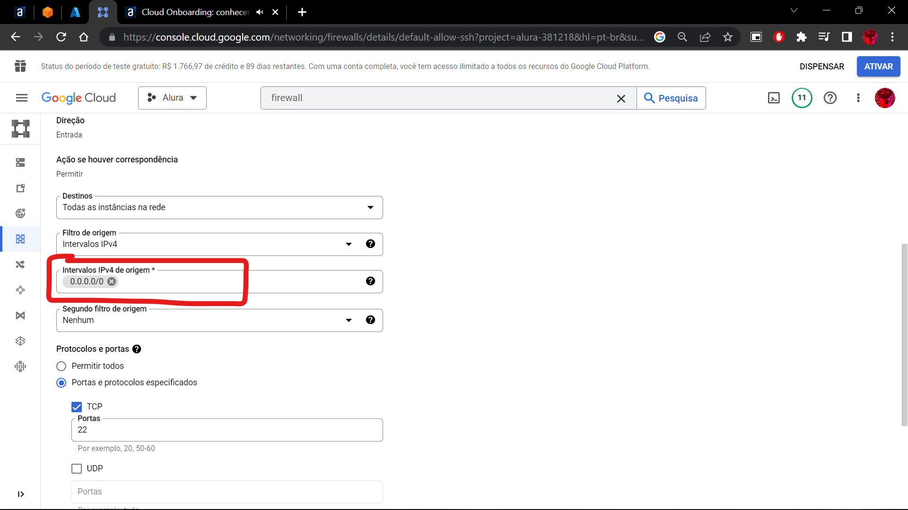

# Redes
Nesse módulo, vamos aprender a configurar as redes das nossas instâncias virtuais.

Na **AWS** e **GCP** chamamos de **VPS**, já na **Azure**, chamamos de **Vnet**, essas redes virtuais funcionam como uma rede física com os mesmos recursos como lista de acessos, firewall etc.

A infraestrutura de nuvem já garante algumas proteções, uma delas é contra ataques **DDOS**.

## **Azure**
A criação da rede pode ser feita de forma manual na aba **redes virtuais** ou de forma "automática" na hora de criar uma instância de uma máquina virtual

Se ambas as máquinas estiverem na mesma região, a conexão entre as duas acontecem de forma automaticamente, já em regiões diferentes, será necessário um roteamento, veremos posteriormente.

**Security Group na Azure:** É no NSG que configuramos a questão de permissão de conexão na nossa máquina, tanto SSH quanto HTTP etc, igual na AWS:


## **Google Cloud Plataform**
Na plataforma do google, as redes já estão criadas em cada região:


Diferente da Azure, no **GPC** você consegue comunicar máquinas em regiões diferentes por default.

Para mexer em regras de segurança na GCP, precisamos entrar na aba **Firewall**, lembrando, ao mexer no Firewall você altera as configurações de rede para todas as máquinas no projeto.

<div style="background-color: rgb(0, 153, 255); border-radius: 10px; text-align: center">

```
Limitando o acesso SSH com chave pública.
```
</div>

Para uma melhor segurança, é melhor que limitemos a nossa instância para receber acesso SSH somente da nossa máquina, fazemos isso de duas formas, limitando o acesso ao nosso ip local de forma manual lá no firewall ou através da chave SSH que pode ser encontrado na pasta ./ssh no sistema operacional:



Depois, basta inserir a chave no campo e salvar.


Para limitar as conexões, basta ir no firewall, no caso do SSH, seria a última opção (default-allow-ssh):



em seguida, só alterar.



## **AWS VPC**
Lá na aba **VPC** da aws, é possível observar que, ao entrar em uma região, nós já ganhamos uma VPC e uma ou mais subnets de acordo com as zonas de disponibilidade da região, exemplo, em Oregon temos 4 zonas, logo, 4 subnets.
